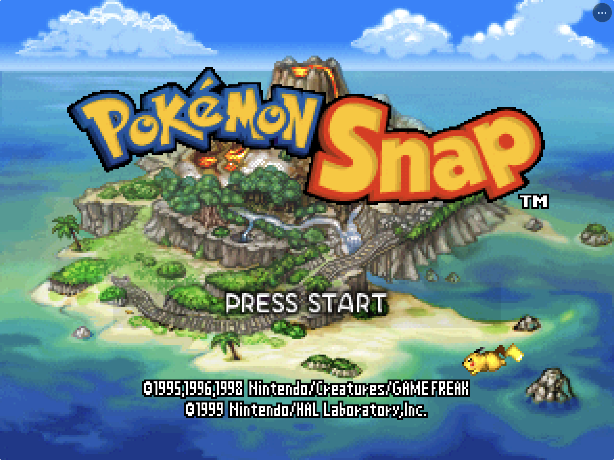
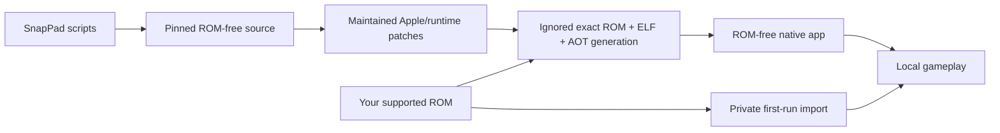

# SnapPad

<p align="center">
  
</p>

<p align="center">
  <strong>Pokémon Snap, statically recompiled for iPhone, iPad, and Apple Silicon Mac.</strong><br>
  Native Metal rendering, customizable touch controls, controller support, and private ROM setup.
</p>

<p align="center">
  
  
  
  
  
</p>



<p align="center">
  <strong><a href="https://github.com/chrissotraidis/snappad/releases/download/v0.1.0/SnapPad-v0.1.0-unsigned.ipa">Download SnapPad v0.1.0 for iPhone and iPad</a></strong><br>
  Unsigned, ROM-free IPA. Re-sign it with AltStore Classic or another compatible sideloading tool.
</p>

SnapPad turns your legally obtained, unmodified **Pokémon Snap (USA)** ROM into a game-specific native Apple app. It runs ahead-of-time ARM64 game code through Metal and includes complete touch controls, controller support, persistent saves, native settings, and a private Files-based setup flow.

Under the hood, SnapPad combines the matching [Pokémon Snap decompilation](https://github.com/ethteck/pokemonsnap) with N64Recomp, N64ModernRuntime, RSPRecomp, and RT64. It is a game-specific static recompile, not a general Nintendo 64 emulator.

This repository contains integration source, patches, scripts, and documentation. It does **not** contain Pokémon Snap, a ROM, extracted Nintendo assets, generated playable game code, saves, in-game photographs, or a playable ROM-derived archive.

> [!IMPORTANT]
> The GitHub release is an **unsigned, ROM-free IPA**. It is not an App Store or TestFlight build and will not install until a sideloading tool re-signs it. You must supply your own legally obtained, unmodified Pokémon Snap (USA) ROM. SnapPad does not need JIT and never downloads game data.

What is already here:

- a native, JIT-free ARM64 app for iOS, iPadOS, and Apple Silicon macOS;
- a complete N64 touch layout with separate phone and tablet customization;
- private ROM validation and storage with no bundled or downloaded game data;
- Metal rendering, FlashRAM saves, controller input, diagnostics, and package-safety audits; and
- reproducible scripts that keep ROMs, generated game code, saves, and signing material out of the repository.

## Install status

| Option | Status | What to do |
|---|---|---|
| GitHub `.ipa` | **Available: v0.1.0** | Download the unsigned ROM-free IPA, re-sign it with AltStore Classic or an equivalent tool, then select your own supported ROM. |
| Local iPhone or iPad build | **Available** | Build the ROM-free app from source, sign it with your own Apple Development team, and supply your own supported ROM after installation. |
| iPhone or iPad Simulator | **Available now** | Follow the build steps below. Simulator is suitable for development and UI/runtime testing, not a substitute for physical-device acceptance. |
| Apple Silicon macOS | **Available now** | Build locally from source and supply your own supported ROM. There is no signed or notarized public download. |
| TestFlight / App Store | **Not available** | The first release is distributed only as an unsigned GitHub IPA. |

On 28 August 2026, the release candidate passed its ROM-free bundle audit and
ran on a physical 12.9-inch iPad Pro with iPadOS 26.6. The supported ROM was
recognized from private app storage, Metal created the native Retina drawable,
audio started through the verified RSP path, and live touch input was observed.
The same candidate also passed the first-run, settings, lifecycle, and gameplay
flows on current iPhone and iPad Simulators.

## Current status

The same statically recompiled core now runs on macOS, iPadOS, and iOS. Progress is accepted from observed game behavior and retained evidence—not merely from successful compilation.

| Target | Current status |
|---|---|
| Apple Silicon macOS | Current desktop product boundary accepted: native first-play photograph/scoring loop, FlashRAM save/reload, measured cadence, clean exit, and 60-minute transition soak |
| iPad Simulator | PaperPad-derived layout, native two-finger viewfinder/shutter, first-play flow, save, termination, and Continue reload accepted |
| iPhone Simulator | Compact touch layout, per-control gameplay input, native settings/reset, fresh title/name/Oak flow, cross-device save, cadence, and background/foreground audio accepted |
| Physical iPad | Current signed development build accepted as stable by the maintainer on a 12.9-inch iPad Pro running iPadOS 26.6 |
| Physical iPhone | ARM64 device build and shared mobile input path are available; dedicated hands-on iPhone acceptance remains limited |
| Public binary distribution | **v0.1.0 available** as an audited unsigned, ROM-free GitHub IPA |

The current mobile build fixes phone-specific input/lifecycle defects discovered during acceptance: quick analog flicks are retained across one complete game update, backgrounding suspends and clears queued audio before a clean foreground resume, and A/Start taps are emitted as single action edges so one touch produces one menu or name-entry action while the other controls retain true hold behavior.

See [Current status](docs/STATUS.md), [Product requirements](docs/PRD.md), [Goal loop](docs/GOAL-LOOP.md), and [Release readiness](docs/RELEASE-READINESS.md) for the dated evidence and remaining gates.

Physical-device work can continue on a signing-capable Mac using the
[data-preserving acceptance handoff](docs/PHYSICAL-DEVICE-ACCEPTANCE.md).

## Supported game input

| Game | Revision | Normalized size | Normalized SHA-1 |
|---|---:|---:|---|
| **Pokémon Snap** | USA | 16 MiB | `edc7c49cc568c045fe48be0d18011c30f393cbaf` |
| Pokémon Snap | Japan, PAL, modified/randomized ROMs | — | Not supported |
| Other Nintendo 64 games | Any | — | Not supported; SnapPad is not a general emulator |

SnapPad accepts `.z64`, `.v64`, and `.n64` byte orders, normalizes an ignored local working copy to big-endian, and rejects every other fingerprint. This fingerprint verifies compatibility; it is not a download hint.

## Install on iPhone or iPad

SnapPad v0.1.0 supports iOS and iPadOS 15 or newer. The published IPA is
unsigned, so it must be re-signed before installation.

1. [Download `SnapPad-v0.1.0-unsigned.ipa`](https://github.com/chrissotraidis/snappad/releases/download/v0.1.0/SnapPad-v0.1.0-unsigned.ipa).
2. Install it with **AltStore Classic plus AltServer**, or another sideloading
   tool that can sign an unsigned IPA. AltStore PAL cannot import arbitrary
   unsigned IPA files.
3. Launch SnapPad and choose your own supported Pokémon Snap ROM through Files.

See the [complete IPA installation and update guide](docs/INSTALL_IPA.md),
including Developer Mode, free-account refresh limits, and preserving your ROM,
saves, and settings during updates.

## Build from source

### What you need

- Apple Silicon Mac
- Xcode 26.x with the macOS and iOS SDKs and downloadable Metal Toolchain
- Homebrew, CMake, Ninja, Git, jq, ripgrep, `uv`, Python 3, and Rust/Cargo
- GNU `cpp-16` (`brew install gcc`)
- Approximately 25 GiB of free build space for the existing incremental trees
- Your own legally obtained, unmodified Pokémon Snap (USA) ROM

Verify the host and fetch the pinned ROM-free source inputs:

```sh
git clone https://github.com/chrissotraidis/snappad.git
cd snappad

scripts/check-prerequisites.sh
scripts/clone-sources.sh
scripts/verify-sources.sh
```

Prepare the ignored local ROM, reproduce the exact ROM/ELF, and generate the ahead-of-time core:

```sh
scripts/build-decomp.sh --rom /absolute/path/to/your/pokemon-snap-rom
scripts/generate-game.sh
```

### macOS

```sh
scripts/build-macos-app.sh
open build-macos-app/SnapPad.app
```

The app bundle is ARM64 and ROM-free. The macOS runtime reads the normalized ROM from SnapPad's private Application Support directory; it is never copied into `SnapPad.app`.

### iPhone or iPad Simulator

Build the app, boot **one Simulator at a time**, then install and launch it:

```sh
scripts/build-ios-simulator.sh
xcrun simctl list devices available
xcrun simctl boot "iPhone 17 Pro"
open -a Simulator
xcrun simctl install booted build-ios-simulator/Release-iphonesimulator/SnapPad.app
xcrun simctl launch booted com.chrissotraidis.snappad
```

On first launch, select the ROM through the native Files picker. SnapPad validates the exact revision, normalizes its byte order, and stores the private copy inside that app container. The installed `.app` remains ROM-free.

SnapPad supports landscape only. If iOS 26 Simulator initially leaves its
device frame in portrait, use Simulator's Rotate control once; this is a host
presentation quirk rather than a portrait gameplay mode.

Shut down the active Simulator before changing device classes:

```sh
xcrun simctl terminate booted com.chrissotraidis.snappad || true
xcrun simctl shutdown booted
```

### Physical iPhone or iPad

An unsigned device bundle can be built and audited without credentials:

```sh
scripts/build-ios-device.sh --unsigned
```

To create an installable private development build, connect the device, install an Apple Development identity and provisioning profile, then provide the development team:

```sh
export SNAPPAD_APPLE_TEAM_ID=YOUR_TEAM_ID
scripts/build-ios-device.sh --signed
```

The signed path preserves the same ARM64-only, iOS 15+, ROM-free package boundary. Never uninstall an existing device copy merely to update it when its private ROM, saves, and settings must be preserved.

## First launch

SnapPad never downloads game data.

1. Launch the macOS, iPhone, iPad, or Simulator app.
2. Choose **Choose ROM**.
3. Select your own supported dump in Files.
4. Wait for exact-revision validation and private normalization.
5. Start with the on-screen Start button, keyboard, or connected controller.

Use **SnapPad Menu → Settings → Manage Game ROM** to replace or remove the private copy later. ROM and save contents are never included in shared diagnostics.

Cancelling Files now returns to the setup screen with a clear message and a
working **Choose ROM** button. It does not close SnapPad or strand the first-run
flow.

## Touch controls and settings

SnapPad retains PaperPad's complete native N64 overlay and interaction model. Phone and tablet layouts are independent, persist locally, and can be moved or reset from Settings.

- **Menu:** the persistent `•••` button opens settings, diagnostics, and game setup.
- **Touch controls:** analog stick, D-pad, A, B, Z, C-buttons, L, R, and Start cover every Pokémon Snap camera, shutter, item, menu, and pause action.
- **Layout editor:** move controls independently, link or unlink four-button clusters, adjust scale and opacity, or restore the current device-class defaults.
- **Resolution:** choose Auto or a fixed 1x–4x internal rendering scale.
- **Framing:** Original preserves the largest centered 4:3 image. Fill Screen center-crops that image. Wide (Experimental) asks RT64 to expand the rendered 3D field; Pokémon Snap's reticle, photo framebuffer, and scoring remain 4:3-authored, so Original is the accuracy default.
- **Volume:** adjust and persist master output volume.
- **Diagnostics:** create a reviewable text report through the system share sheet.
- **ROM management:** replace or remove the privately stored supported ROM.

Opening the menu, Settings, share sheet, or ROM picker clears held input and hides gameplay targets. Dismissing the sheet restores them only when Touch Controls is enabled. A physical controller hides gameplay touch targets while keeping the menu available, then restores touch controls after disconnect.

### Keyboard and controller bindings

| N64 input | macOS keyboard | N64 input | macOS keyboard |
|---|---|---|---|
| A | `Z` | B | `X` |
| Start | Return | Z | Left Shift |
| L / R | `Q` / `E` | Analog stick | Arrow keys |
| D-pad | `W` `A` `S` `D` | C-buttons | `I` `J` `K` `L` |

SDL-compatible controllers use the left stick, D-pad, face buttons, shoulders, left trigger for Z, and right stick for the C-buttons. Deterministic tests cover assignment, held-input release, reconnect, slot preservation, and foreground reconciliation. Complete physical-device mapping and sleep/reconnect acceptance remain open.

See the [PaperPad parity contract](docs/PAPERPAD-PARITY.md) for the exact source-derived boundary and each audited Pokémon Snap-specific divergence.

## What works

| Area | Current implementation |
|---|---|
| Native code | Static ARM64 game code on Apple targets; no JIT or downloaded executable code |
| Rendering | RT64 presentation through Metal with Retina drawable sizing |
| Audio | Verified recompiled `aspMain` path, native output conversion, bounded queue, and mobile background suspension |
| Game setup | Native ROM selection, three-byte-order normalization, exact revision validation, and private storage |
| Touch | Full N64 overlay, multi-touch, fixed/clamped analog stick, independent phone/tablet layouts, editing, opacity, and reset |
| Display | Auto and fixed 1x–4x internal scales; original 4:3, center-cropped Fill Screen, and default-off experimental expanded projection |
| Input | macOS keyboard/controller support and iOS SDL controller mappings |
| Saves | 128 KiB FlashRAM persistence and cross-device-compatible save files |
| Support | Bounded current/previous logs, session marker, package audits, and privacy-conscious system share sheet |
| Repository safety | Pinned dependencies, maintained patch replay, and ROM/signing/private-data publication checks |

Higher internal resolution improves geometry edges and sampling. It cannot reconstruct detail absent from the original low-resolution text, sprites, or textures.

## Performance

Pokémon Snap's baseline gameplay presentation is approximately 30 fps while the native input and screen-update bridge runs near 60 Hz. SnapPad does not enable an enhanced-framerate patch by default.

On an iPhone 17 Pro Simulator running iOS 26.5, an unattended 45-second live Beach sample measured:

| Signal | Mean | Observed range |
|---|---:|---:|
| Input polling | 59.918 Hz | 55.888–60.878 Hz |
| Screen updates | 59.918 Hz | 55.888–60.878 Hz |
| Presented gameplay frames | 29.937 fps | 27.944–31.000 fps |

The sample contained two one-second intervals below 29 presented fps and one interval below 58 input polls/s, followed by immediate recovery. Because input, screen updates, and presentation dipped together, the current evidence points to a short whole-process/Simulator scheduling stall rather than a sustained renderer-only slowdown. Physical-device profiling remains required before treating Simulator stutter as device behavior.

A matched successful-present interval comparison also found no benefit from
forcing 2x instead of Auto's renderer-confirmed 6x on the iPhone Simulator;
Auto was slightly faster over the same Beach band. SnapPad therefore retains
PaperPad's Auto default while physical-device profiling remains open.

See [Performance evidence](docs/PERF.md) and [Current status](docs/STATUS.md) for longer samples and measurement limits.

## Known limits

- Full progression through River, Cave, Valley, Rainbow Cloud, credits, and every report/album/gallery path is not yet accepted.
- Scene ambience, every cry/UI/shutter effect, pitch, interruption behavior, and long-run audio quality are not comprehensively verified.
- A visible opening terrain seam remains a renderer-correctness issue.
- Controller handoff, system-audio interruption, exact phone grip feel, and physical-device simultaneous touch still need hands-on acceptance. Native iPad two-finger shutter input, phone per-control input, phone settings, diagnostics export, installed-ROM management, same-ROM replacement, and cold relaunch are accepted at Simulator scope.
- A 60-minute mobile soak with mobile memory-growth measurement and broader
  transition stress remain open. A native macOS hour-long transition soak and
  a signed physical-iPad run are complete.
- The Pokémon Snap decompilation and translated-code rights boundary remains
  legally unresolved; the maintainer has authorized this free source snapshot
  and unsigned ROM-free community release, not commercial or official-store
  distribution.

## Diagnostics and bug reports

Open **SnapPad Menu → Share Diagnostics & Logs…** after reproducing a problem. The report includes:

- app/build, system, screen, settings, and renderer-confirmed resolution metadata;
- only whether a supported-size ROM is present, never ROM or save contents;
- at most the last 512 KiB of current and previous runtime logs; and
- a possible-unclean-session label when the previous run did not remove its private session marker.

Known app-container, home, and temporary paths are sanitized, but arbitrary runtime text is **not guaranteed to be anonymous**. Review and redact the report before sharing it.

Include the SnapPad revision, device and OS, exact reproduction steps, expected and actual behavior, and a screenshot for visual defects. Never attach or request ROMs, extracted assets, generated game code, saves, in-game photographs, signing files, credentials, or private device data.

After a macOS or Simulator crash, run `scripts/capture-crashes.sh` to collect only new local SnapPad crash evidence.

## Reproducible and private by construction



`dependencies.lock.json` records exact source revisions and the supported ROM fingerprint. Reference checkouts live under ignored `ref/`; ROM-derived/AOT input lives under ignored `generated/`. Fetch scripts disable upstream push URLs, and maintained patches replay through the local patch driver.

Before publishing or reviewing source, run:

```sh
scripts/check-repo-safety.sh
git diff --check
```

The safety audit rejects game data, generated packages, signing material, likely credentials, tracked reference checkouts, personal paths, and oversized files from the publishable tree and history.

## Frequently asked questions

<details>
<summary><strong>Does SnapPad include Pokémon Snap?</strong></summary>

No. You must provide your own legally obtained, unmodified Pokémon Snap (USA) ROM. Do not request game data or download links.
</details>

<details>
<summary><strong>Is there an IPA, TestFlight, or App Store build?</strong></summary>

Yes. The GitHub release provides an audited, unsigned, ROM-free IPA for iOS and iPadOS 15 or newer. AltStore Classic plus AltServer, or another compatible tool, must re-sign it before installation. There is no TestFlight or App Store build.
</details>

<details>
<summary><strong>Is the game playable?</strong></summary>

Yes. The same AOT core completes the macOS first-play loop, runs the accepted mobile gameplay flow, and has been played on a physical iPad Pro. Broader full-game progression, long mobile soaks, and dedicated physical-iPhone coverage remain ongoing compatibility work.
</details>

<details>
<summary><strong>Why does gameplay report about 30 fps?</strong></summary>

That is the current baseline game presentation cadence, not a 60 fps enhancement target. Input and screen updates run near 60 Hz. Short Simulator stalls are tracked separately from the intended gameplay cadence and must be compared against physical-device traces.
</details>

<details>
<summary><strong>Does it support physical controllers?</strong></summary>

Controller mappings and touch-overlay handoff are implemented through SDL2, and deterministic host tests protect assignment, reconnect, and held-input release. Complete physical iPhone/iPad controller mapping, wired/Bluetooth reconnect, and natural-sleep behavior remain release checks.
</details>

<details>
<summary><strong>Is the entire game verified?</strong></summary>

No. Testing covers the first-play loop, early courses, targeted progression paths, save persistence, and mobile bring-up. A full-game regression and longer device soak remain open.
</details>

## Project map

| Path | Purpose |
|---|---|
| [`port/apple/`](port/apple/) | UIKit lifecycle, setup, settings, diagnostics, touch UI, privacy manifest, and app metadata |
| [`port/runtime/`](port/runtime/) | Native runner, input, renderer bridge, game hooks, paths, saves, and generated-code integration |
| [`config/`](config/) | Pokémon Snap-specific N64Recomp configuration |
| [`port/patches/`](port/patches/) | Ordered fixes for pinned N64ModernRuntime, N64Recomp, and RT64 source |
| [`scripts/`](scripts/) | Fetch, validate, generate, build, test-support, and repository-audit automation |
| [`tests/`](tests/) | Deterministic input, generation, runtime, packaging, and safety regressions |
| [`docs/`](docs/) | Requirements, architecture evidence, status, performance, safety, and release documentation |
| `ref/` | Ignored pinned source and local reference inputs; never published |
| `generated/` | Ignored ROM-derived and AOT build input; never published |

## Documentation

- [Product requirements and architecture](docs/PRD.md)
- [Current status](docs/STATUS.md)
- [Performance evidence](docs/PERF.md)
- [PaperPad parity contract](docs/PAPERPAD-PARITY.md)
- [Save and accessory behavior](docs/SAVE-AND-ACCESSORIES.md)
- [RSP inventory](docs/RSP.md)
- [Overlay model](docs/OVERLAYS.md)
- [Maintained runtime patches](docs/PATCHES.md)
- [Release readiness](docs/RELEASE-READINESS.md)
- [Rights status](docs/RIGHTS-STATUS.md)

## Credits and design references

SnapPad builds on the Pokémon Snap decompilation, PaperPad, Paper-Mario-ReCut, N64Recomp, N64ModernRuntime, RSPRecomp, RT64, mupen64plus-rsp-hle, SDL2, zstd, and their contributors.

Its Apple shell, touch layout, persistent menu, modal input lifecycle, controller ownership, build discipline, diagnostics, and evidence model are deliberately adapted from the pinned PaperPad implementation. Pokémon Snap-specific timing, input, audio, save, overlay, and gameplay behavior is accepted separately rather than assumed from PaperPad.

## Legal and rights boundary

SnapPad is an independent, unofficial project and is not affiliated with, endorsed by, or sponsored by Nintendo, The Pokémon Company, or their partners. Pokémon Snap and related names, characters, copyrights, and trademarks belong to their respective owners.

The pinned Pokémon Snap decompilation has no general root license. A ROM-free package does not by itself establish redistribution permission, and static recompilation may still embody translated game logic. The maintainer explicitly authorized the free v0.1.0 source snapshot and unsigned ROM-free IPA on 28 August 2026; that decision does not grant rights in upstream code or Nintendo material and is not legal advice. See [Rights and licenses](RIGHTS_AND_LICENSES.md) and [Release readiness](docs/RELEASE-READINESS.md).
